# RELATÓRIO (MODELO)

> Nesse relatório, encontram-se as propostas de melhorias no código do projeto de Supermercado.

## SUGESTÕES DA EQUIPE DE TESTE

Abaixo, encontram-se os problemas identificados pela equipe de teste e as sugestões de melhorias propostas pelo responsável.

## SUGESTÕES DO DESENVOLVEDOR

Abaixo, encontram-se os problemas identificados e as sugestões de melhorias propostas pelo responsável.

SUGESTÃO #1: Nomeação adequada e legibilidade (Exemplo)

**Arquivo: CarrinhoDeCompras.java**

**Código atual:**

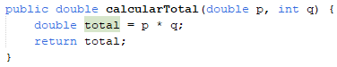

**Sugestão de melhoria:**

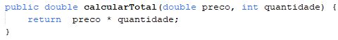

**Justificativa:**
Os parâmetros “p” e “q” foram renomeados para “preço” e “quantidade” com o objetivo de deixar o código mais claro sobre o que está acontecendo. Além disso, o método foi simplificado para deixá-lo mais curto e melhorar a legibilidade.

SUGESTÃO #2: Métodos duplicados

**Arquivo: Cliente.java**

**Código atual:**

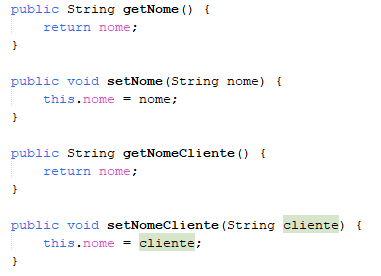

**Sugestão de melhoria:**

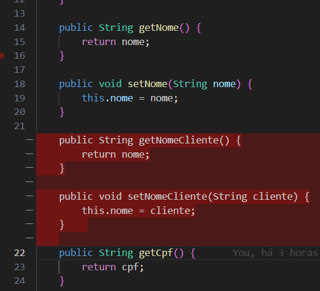

**Justificativa:**
Código mais limpo, reduzindo duplicidade e melhoria manutenção.

🔗 [729ca99](https://github.com/TDS-ATIVIDADES/UC07-660013566D/commit/729ca99)

SUGESTÃO #3: Substituição de atributo por objeto

**Arquivo: Pedido.java**

**Código atual:**

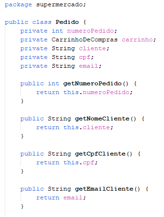

**Sugestão de melhoria:**

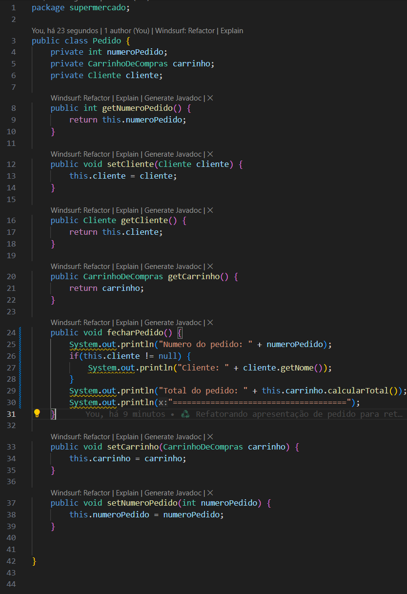

**Justificativa:**
Centraliza dados do cliente, reduz duplicidade e inconsistência.

🔗 [92a11f0](https://github.com/TDS-ATIVIDADES/UC07-660013566D/commit/92a11f0)

SUGESTÃO #4: Espaços em branco e recuo

**Arquivo: Supermercado.java**

**Código atual:**

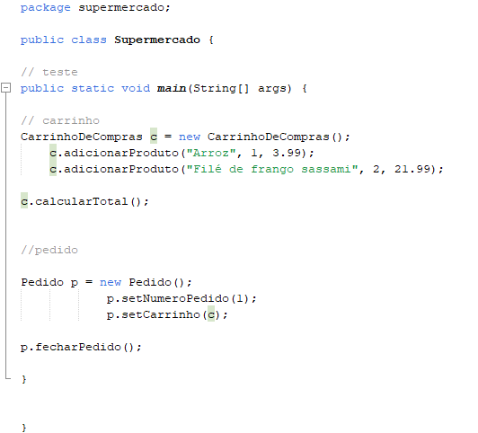

**Sugestão de melhoria:**

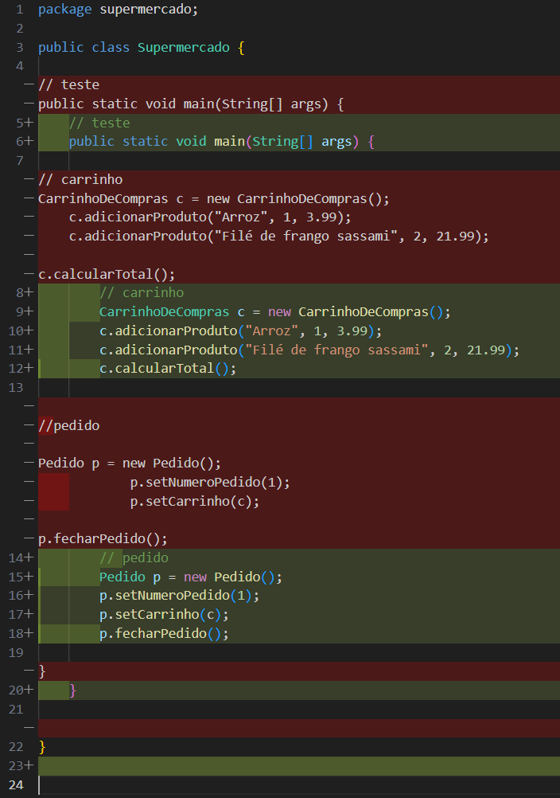

**Justificativa:**
Facilita a legibilidade do conteúdo do arquivo.

🔗 [d6d1b4e](https://github.com/TDS-ATIVIDADES/UC07-660013566D/commit/d6d1b4e)

SUGESTÃO #5: Comentários do código

**Arquivo: Supermercado.java**

**Código atual:**

**Sugestão de melhoria:**

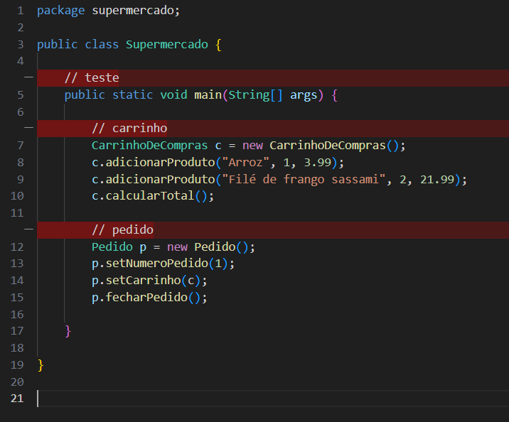

**Justificativa:**
Comentários genéricos não acrescentam informação; comentários úteis devem explicar por que o código existe ou decisões importantes, melhorando manutenção e legibilidade.

🔗 [04fc814](https://github.com/TDS-ATIVIDADES/UC07-660013566D/commit/04fc814)

SUGESTÃO #6: Nomeação adequada

**Arquivo: Supermercado.java**

**Código atual:**

**Sugestão de melhoria:**

**Justificativa:**
As variáveis c e p foram renomeadas para carrinho e pedido, respectivamente com o objetivo de deixar o código mais claro sobre o que está acontecendo e sobre o que se tratam as variáveis em questão.

🔗 [91e34c0](https://github.com/TDS-ATIVIDADES/UC07-660013566D/commit/91e34c0)

SUGESTÃO #7: Utilização de dados persistentes a classe

**Arquivo: Produto.java**

**Código atual:**

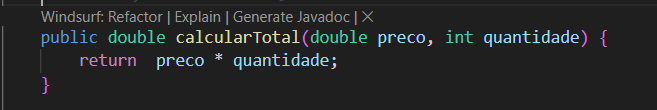

**Sugestão de melhoria:**

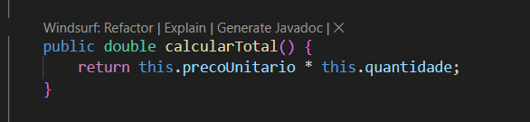

**Justificativa:**
Método não utilizava os valores de propriedades já existentes a classe. Dessa maneira, alinha o método à responsabilidade da classe Produto (encapsular dados e operações relacionadas ao produto). Evita inconsistência de dados e torna o código mais legível e enxuto.

🔗 [d866263](https://github.com/TDS-ATIVIDADES/UC07-660013566D/commit/d866263)

SUGESTÃO #8: Implementar métodos getters e setters ausentes

**Arquivo: Produto.java**

**Código atual: Inexistente**

**Sugestão de melhoria:**

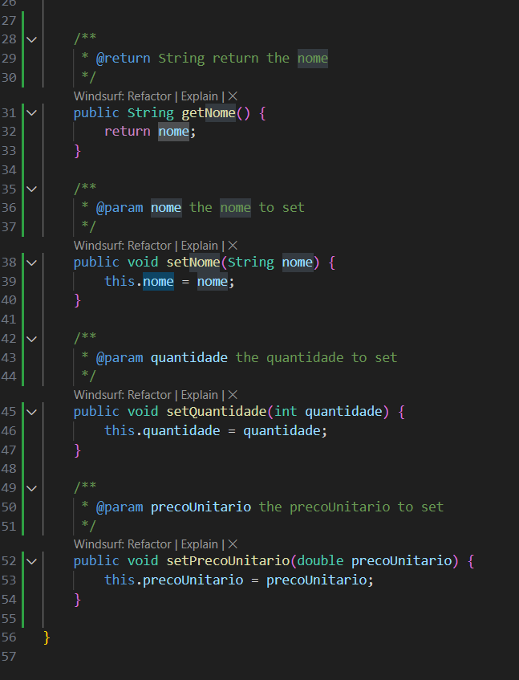

**Justificativa:**
Adicionando métodos get/set para a propriedade nome que não existiam e tornava-a inútilizável dentro da classe.
Também foram criados métodos set para as propriedades quantidade e precoUnitario para habilitar/liberar a edição de valores caso ocorra um erro de digitação, por exemplo.

🔗 [0dc1c93](https://github.com/TDS-ATIVIDADES/UC07-660013566D/commit/0dc1c93)

SUGESTÃO #9: Adição de produtos ao carrinho

**Arquivo: CarrinhoDeCompras.java**

**Código atual:**

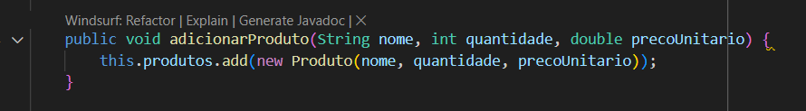

**Sugestão de melhoria:**

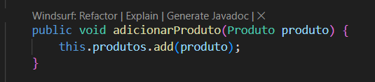

**Justificativa:**
Método adicionarProduto está sobrecarregado de responsabilidades, já que está criando o produto além de adicionar o produto ao carrinho. A responsabilidade de criar o produto deve ficar essencialmente com a classe produto.

🔗 [9422dcb](https://github.com/TDS-ATIVIDADES/UC07-660013566D/commit/9422dcb)

SUGESTÃO #10: Cálculo total de carrinho

**Arquivo: CarrinhoDeCompras.java**

**Código atual:**

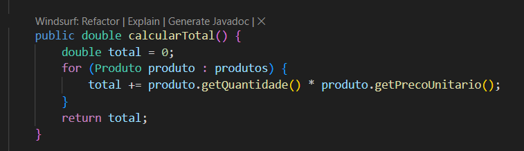

**Sugestão de melhoria:**

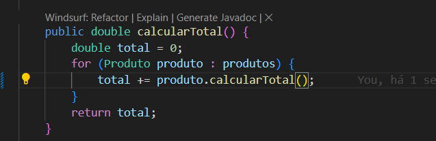

**Justificativa:**
O método calcularTotal da classe CarrinhoDeCompras pode ser simplificado aproveitando a refatoração do método calcularTotal da classe Produto (Vide Sugestão #7), centralizando a lógica de cálculo somente na classe Produto e retirando essa responsabilidade da classe CarrinhoDeCompras.

🔗 [8ea44e3](https://github.com/TDS-ATIVIDADES/UC07-660013566D/commit/8ea44e3)

SUGESTÃO #11: Método ignorado

**Arquivo: Supermercado.java**

**Código atual:**

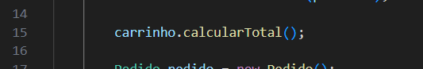

**Sugestão de melhoria:**

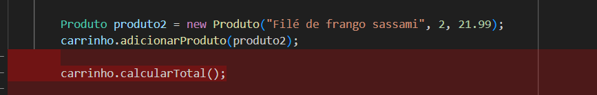

**Justificativa:**
Método calcularTotal retorna o valor do carrinho, porém esse valor não é atribuído a uma variável, e nem apresentado, tornando-o inútil ao código.

🔗 [84d1043](https://github.com/TDS-ATIVIDADES/UC07-660013566D/commit/84d1043)

SUGESTÃO #12: Apresentação em Camada errada

**Arquivo: CarrinhoDeCompras.java**

**Código atual:**

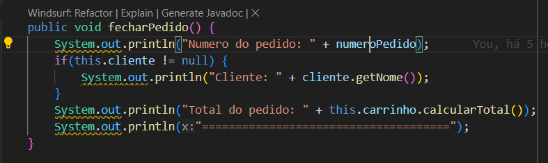

**Sugestão de melhoria:**

**Arquivo: Supermercado.java**

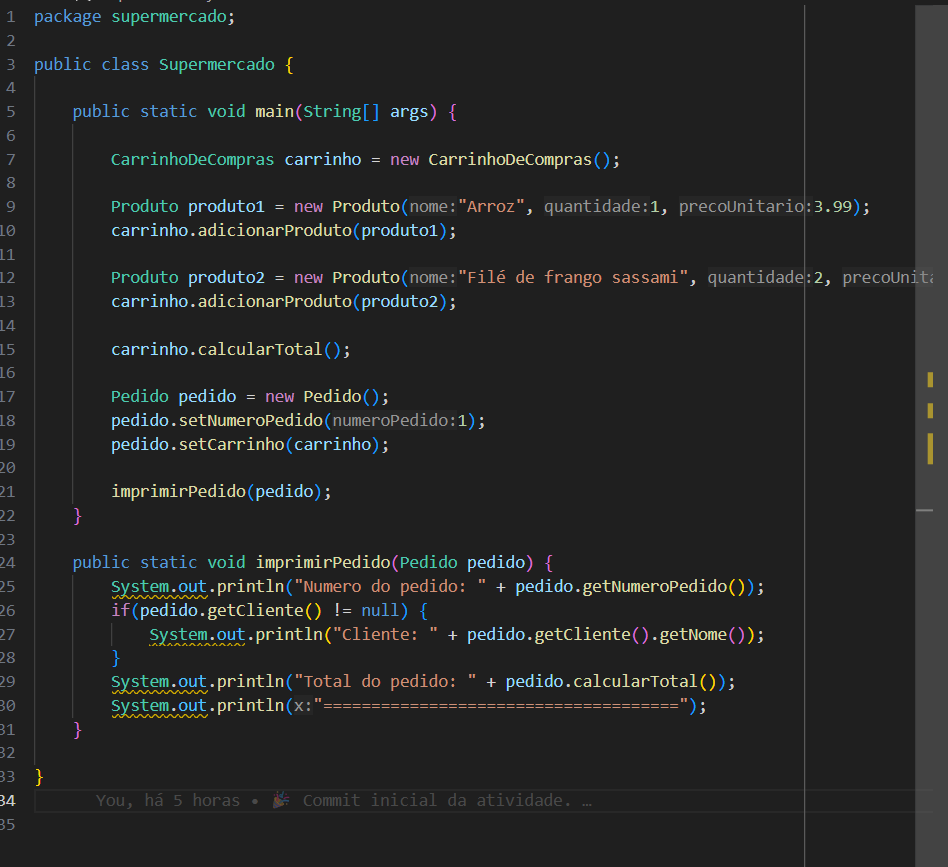

**Justificativa:**
O método fecharPedido da classe Pedido, estava misturando a lógica de apresentação com a lógica de negócio. Centralizei a apresentação somente na classe responsável Supermercado para facilitar ajustes relacionados.

🔗 [db1be36](https://github.com/TDS-ATIVIDADES/UC07-660013566D/commit/db1be36)

SUGESTÃO #13: Nomeclatura de pacote

**Arquivo: Todos**

**Código atual:**

**Sugestão de melhoria:**

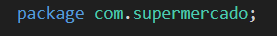

**Justificativa:**
No Java, os nomes de pacotes seguem convenções globais de domínio de internet, invertido.

🔗 [dd045fa](https://github.com/TDS-ATIVIDADES/UC07-660013566D/commit/dd045fa)

SUGESTÃO #14: Nomeclatura de Classe

**Arquivo: Supermercado**

**Código atual:**

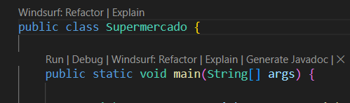

**Sugestão de melhoria:**

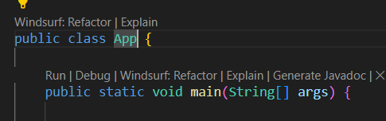

**Justificativa:**
Facilitar identificação técnica da classe inicial/principal do projeto/pacote/aplicação

🔗 [dab6407](https://github.com/TDS-ATIVIDADES/UC07-660013566D/commit/dab6407)

---
